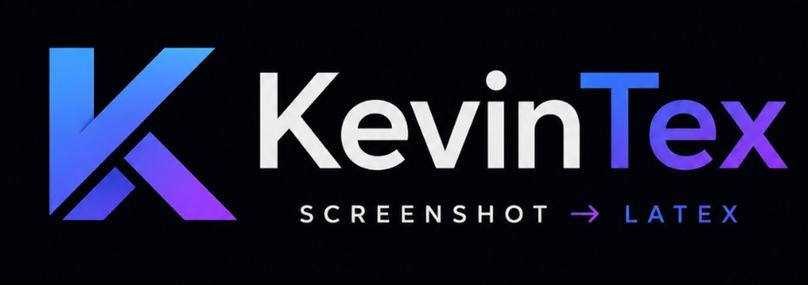

<p align="center">
  
</p>

# KevinTex — Snip & Get

A local, free, unlimited formula-image → LaTeX converter (a self-hosted
alternative to SimpleTex). Paste, drop, or **snip** a screenshot of a math
formula and get editable Markdown + LaTeX with a live rendered preview.
Recognition defaults to the quantized
[Gemma 4 E2B-it](https://huggingface.co/unsloth/gemma-4-E2B-it-GGUF)
vision-language model through llama.cpp. On first launch, you can either
download those local weights or use hosted Gemma 4 through a Google AI Studio
API key.

## Features

- **Snip button** (the computer-with-+ icon) — click it, drag a screen region,
  and the capture is converted instantly. Fully self-contained (Pillow +
  tkinter region selector); no `gnome-screenshot`/`flameshot`/portal needed.
- **Paste (Ctrl+V), drag-and-drop, or browse** for a formula image (PNG/JPG/BMP/WEBP)
- **Text sharpener** with persisted Off / Auto / Strong modes — conservative
  contrast normalization, smart upscaling, scan denoising, and edge sharpening
  improve small screenshots without thresholding away formula structure.
- **Draw a formula** in the responsive handwriting pad, with pen/eraser,
  pressure-aware pointer input, stroke width, undo/redo, clear, and useful
  fraction/root/integral/matrix starters. Drawings go directly to local Gemma.
- **Voice-to-LaTeX** — dictate a formula through the microphone; Gemma turns
  spoken math into editable Markdown + LaTeX entirely on-device through MLX on
  Apple Silicon and llama.cpp on Windows/Linux.
- **Image preparation tools** — rotate before OCR, invert dark screenshots, and
  compare the original with the exact processed image sent to recognition.
- **Live KaTeX preview** (bundled locally — the app works with no internet at all)
- **Editable output** — fix the LaTeX by hand and the preview updates
- **Copy formats**: raw, `$…$`, `$$…$$`, `\[…\]`, `\(…\)`, `\begin{equation}…\end{equation}`, Markdown
- **Auto-copy after recognition** (configurable in Settings)
- **Thinking mode** for deeper multi-pass OCR verification on dense pages
- **History** with search, individual deletion, and safe clear-all controls
- **Recognize again** using the current source image and active Thinking setting
- **Download `.tex`** output and keyboard shortcuts (`Ctrl/Cmd+K`, `Ctrl/Cmd+S`)
- **Native desktop builds** for Ubuntu, Windows, and Apple Silicon macOS
- **Hardware acceleration** with CUDA on Linux/Windows and MLX/Metal on Apple Silicon
- **Switchable backend** — Gemma is the default; `LOCALTEX_BACKEND=lfm-vl` or
  `LOCALTEX_BACKEND=pix2tex` selects an alternative local backend. The macOS
  application selects `LOCALTEX_BACKEND=mlx` automatically.
- **Local or cloud Gemma** — choose **Download model weights** or **Use Google
  AI Studio API** on first launch. Change the choice later in Settings. The
  hosted option uses `gemma-4-26b-a4b-it`; images are sent to Google and usage
  follows your AI Studio quota/billing.

## Install

Prebuilt packages are attached to each [GitHub release](https://github.com/EV3KevinDEV/KevinTex/releases):

- **Ubuntu:** `kevintex_1.2.5_all.deb`
- **Windows:** portable `KevinTex-1.2.5-windows-x64.zip` containing `KevinTex.exe`
- **Apple Silicon macOS:** `KevinTex-1.2.5-macOS-arm64.dmg` or `.zip`

The Windows and macOS applications open in a native window. Local model weights
are not bundled; if you choose the local provider, they download to the current
user's application-data directory. The macOS build requires an M-series Mac
and uses MLX/Metal for its local provider.

### Ubuntu desktop app

Two options:

**System-wide (.deb):**

```bash
packaging/build-deb.sh
sudo apt install ./dist/kevintex_1.2.5_all.deb
```

**Current user only (no root):**

```bash
packaging/install-user.sh
```

Either way you get a **KevinTex** entry in the applications menu with its own
icon. Launching it starts the local server and opens the app in its own
native window (Chrome/Chromium app mode; falls back to your browser).
Closing the window stops the server. On first launch, the app shows a provider
setup screen. The local choice downloads PyTorch/llama.cpp model weights; the
AI Studio choice asks for a key from
<https://aistudio.google.com/app/apikey> and does not download model weights.

The app window's **Snip** button (computer-with-+ icon) opens a fullscreen
region selector: drag a box around a formula and it's converted immediately —
the LaTeX lands in your clipboard if auto-copy is on. No external screenshot
tool required.

## Run from source (dev)

```bash
./run.sh
```

Then open http://127.0.0.1:8321 (the script opens it for you). The first launch
asks whether to download the local Gemma weights or configure Google AI Studio.

## Manual setup (if moving to another machine)

```bash
python3 -m venv .venv
.venv/bin/pip install torch torchvision --index-url https://download.pytorch.org/whl/cu121
.venv/bin/pip install -r requirements.txt
.venv/bin/uvicorn app:app --port 8321
```

## Tips for best recognition

- The Gemma vision model handles full formulas, sums, integrals, matrices, and
  mixed text+math better than the old formula-only model. Still, crop fairly
  tightly around the formula for best fidelity.
- Higher-resolution, high-contrast screenshots work best.
- Leave **Text sharpener** on Auto for most screenshots. Strong is intended for
  noisy or low-contrast scans; Off preserves source pixels. Use **Invert** for
  light-on-dark captures and the Original/Processed switch to check the result.
- Use the **Snip** button for the fastest workflow, or bind a region-screenshot
  hotkey (e.g. GNOME `Shift+PrtSc`) to copy a region to the clipboard, then
  Ctrl+V into the app.

## Preprocessing API

`POST /api/preprocess` accepts multipart image data plus `preprocess`
(`off`, `auto`, or `strong`), `rotation` (`0`, `90`, `180`, or `270`), and
`invert` (boolean), and returns the prepared PNG without loading the OCR model.
The same fields are accepted by `POST /api/convert`; `/api/snip` accepts them as
query parameters. Conversion responses include the applied preprocessing
metadata.

`POST /api/voice` accepts a 16 kHz mono WAV file in the `audio` multipart field
and an optional `thinking` boolean. It is available with local Gemma backends
and is hidden while the hosted AI Studio provider is active.

## Performance and resource controls

KevinTex serializes access to each model context, prevents duplicate model
loads, runs inference outside FastAPI's event loop, and rejects oversized
uploads before image decoding. Images are closed promptly after conversion.
The following optional environment variables tune local inference:

- `LOCALTEX_N_CTX` — context size (default `16384`)
- `LOCALTEX_N_GPU_LAYERS` — llama.cpp GPU offload (`-1` means all)
- `LOCALTEX_N_BATCH` — llama.cpp prompt batch size
- `LOCALTEX_N_THREADS` — CPU inference threads
- `LOCALTEX_MAX_UPLOAD_BYTES` — upload cap (default 20 MiB)
- `LOCALTEX_INFERENCE_QUEUE_TIMEOUT` — wait before returning busy
- `LOCALTEX_PROVIDER=local|cloud` — optionally select the Gemma provider before startup
- `GEMINI_API_KEY` — optionally provide the Google AI Studio key through the environment

The Settings UI stores a key in the per-user `provider.json` file with
user-only permissions where supported. The key is not stored in browser
`localStorage` or returned by the provider status API.
